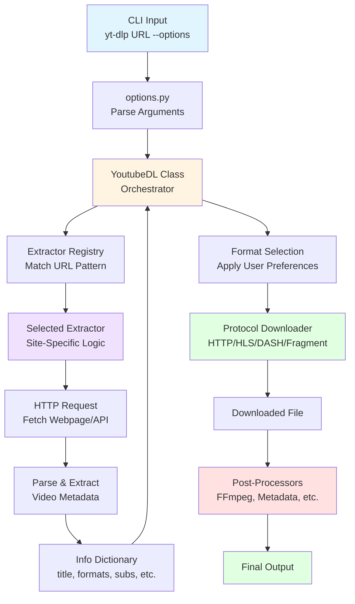
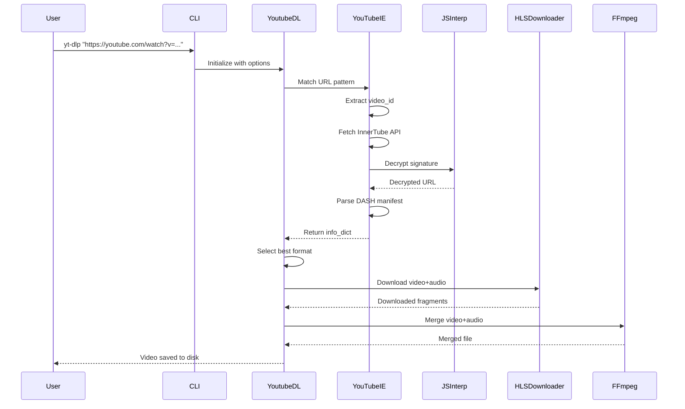

# yt-dlp Technical Documentation

This documentation provides an in-depth technical guide to the yt-dlp project architecture, design patterns, and implementation details.

## Table of Contents

### Core Documentation
- [Architecture](architecture.md) - Technical design and data flow
- [Python Features & Coding Style](python-features.md) - Python patterns used throughout the project
- [Testing Methodology](testing.md) - How yt-dlp tests complex extraction logic
- [Features](features.md) - Comprehensive feature overview
- [Networking](networking.md) - Network layer abstraction and backends
- [Downloaders](downloaders.md) - Protocol-specific download handlers
- [Post-Processors](postprocessors.md) - Post-processing pipeline
- [Development Guide](development.md) - Creating new extractors

### Usage Documentation
- [CLI Usage Patterns](cli-usage.md) - Common command-line workflows
- [Configuration](configuration.md) - Configuration file formats and options
- [Troubleshooting](troubleshooting.md) - Common issues and solutions
- [Performance](performance.md) - Optimization techniques

### Extractor Deep Dives
- [00 - Extractor Overview](extractors/00-overview.md) - How extractors work
- [01 - Simple Example](extractors/01-simple-example.md) - ShareVideosEmbed (minimal implementation)
- [02 - YouTube](extractors/02-youtube.md) - Most complex extractor (multi-file architecture)
- [03 - Twitter](extractors/03-twitter.md) - GraphQL APIs and JavaScript interpretation
- [04 - Twitch](extractors/04-twitch.md) - Live streaming and VOD handling
- [05 - SoundCloud](extractors/05-soundcloud.md) - Dynamic client ID extraction
- [06 - TikTok](extractors/06-tiktok.md) - Mobile app emulation
- [07 - Vimeo](extractors/07-vimeo.md) - OAuth and JWT token management
- [08 - HotStar](extractors/08-hotstar.md) - DRM and authentication
- [09 - CDA](extractors/09-cda.md) - Custom encryption schemes
- [10 - Kaltura](extractors/10-kaltura.md) - Embeddable platform architecture
- [11 - Archive.org](extractors/11-archiveorg.md) - Multi-format handling
- [12 - Generic](extractors/12-generic.md) - Intelligent fallback extractor

---

## What is yt-dlp?

**yt-dlp** is a feature-rich command-line audio/video downloader supporting thousands of websites. It is a fork of youtube-dl with enhanced features, better performance, and active maintenance.

### Problem Statement

Media content on the web exists in various formats, qualities, and behind different authentication mechanisms. Users face several challenges:

1. **Format Fragmentation**: Videos may be served as progressive downloads, HLS streams, DASH manifests, or proprietary formats
2. **Quality Selection**: Multiple quality options require intelligent selection and merging (separate video/audio tracks)
3. **Access Control**: Content may require authentication, cookies, or geo-restriction bypass
4. **Site-Specific Logic**: Each platform has unique URL structures, API endpoints, and data formats
5. **Post-Processing**: Downloaded media often needs format conversion, metadata embedding, or thumbnail extraction

### Solution

yt-dlp provides a unified interface that:

- **Abstracts site-specific complexity** through 1000+ specialized extractors
- **Handles multiple protocols** (HTTP, HLS, DASH, RTMP, fragments)
- **Intelligently selects formats** based on user preferences
- **Manages authentication** via cookies, tokens, and credentials
- **Post-processes media** using FFmpeg integration
- **Provides flexibility** through extensive CLI options and configuration

---

## High-Level Architecture



### Key Components

1. **CLI Parser** (`options.py`) - Parses 100+ command-line options
2. **YoutubeDL** (`YoutubeDL.py`) - Central orchestrator managing the entire workflow
3. **Extractors** (`extractor/`) - 1000+ site-specific extraction modules
4. **Downloaders** (`downloader/`) - Protocol-specific download handlers
5. **Post-Processors** (`postprocessor/`) - Media transformation pipeline
6. **Network Layer** (`networking/`) - HTTP backend abstraction
7. **Utilities** (`utils/`) - Shared helper functions

---

## How It Works

### 1. URL to Extractor Mapping

When you provide a URL, yt-dlp:

1. Iterates through registered extractors
2. Tests each extractor's `_VALID_URL` regex pattern
3. Selects the first matching extractor
4. Falls back to `GenericIE` if no match found

```python
# Example from an extractor
class SoundCloudIE(InfoExtractor):
    _VALID_URL = r'https?://(?:www\.)?soundcloud\.com/[\w-]+/[\w-]+'

    def _real_extract(self, url):
        # Extract video_id from URL
        # Fetch metadata
        # Return info dictionary
        pass
```

### 2. Information Extraction

The selected extractor:

1. Fetches the webpage or API response
2. Parses HTML/JSON to extract metadata
3. Handles site-specific authentication
4. Resolves format URLs (may require decryption)
5. Returns a standardized **info dictionary**

**Info Dictionary Structure:**
```python
{
    'id': 'video_id',
    'title': 'Video Title',
    'description': 'Description text',
    'uploader': 'Channel Name',
    'duration': 120,  # seconds
    'formats': [
        {
            'format_id': '1080p',
            'url': 'https://...',
            'height': 1080,
            'vcodec': 'h264',
            'acodec': 'aac',
            'filesize': 50000000,
        },
        # ... more formats
    ],
    'subtitles': {...},
    'thumbnails': [...],
}
```

### 3. Format Selection

YoutubeDL selects the best format based on:

1. User-specified format string (`-f`)
2. Quality preferences (height, bitrate, codec)
3. Format availability
4. Merge requirements (separate video+audio)

### 4. Download

The appropriate downloader is selected based on:

- **HTTP/HTTPS**: Direct download or chunked
- **HLS** (m3u8): HTTP Live Streaming with fragment assembly
- **DASH** (mpd): Dynamic Adaptive Streaming with separate audio/video
- **Fragment-based**: Resumable downloads with state management
- **RTMP**: Flash streaming protocol
- **External**: Delegation to aria2c, wget, or curl

### 5. Post-Processing

After download, post-processors execute in sequence:

1. **Format Conversion**: FFmpeg transcoding
2. **Audio Extraction**: Extract audio from video
3. **Merging**: Combine video+audio tracks
4. **Metadata**: Embed title, artist, thumbnail
5. **Thumbnail**: Embed or extract thumbnail
6. **Chapters**: Modify chapter markers
7. **SponsorBlock**: Remove sponsored segments

---

## Data Flow Example

Let's trace a typical YouTube video download:



---

## Project Statistics

- **Python Version**: 3.10+
- **Total Extractors**: 1000+ (across ~1013 files)
- **Supported Sites**: Thousands
- **Main Module**: 4,504 lines (`YoutubeDL.py`)
- **Largest Extractor**: YouTube (8,083 lines across 9 files)
- **Test Coverage**: Comprehensive live and unit tests

---

## Key Design Patterns

### 1. Extractor Pattern
Each site has a dedicated extractor class inheriting from `InfoExtractor`, providing:
- URL pattern matching
- Site-specific extraction logic
- Standardized output format

### 2. Strategy Pattern
Multiple implementations for different protocols:
- HTTP, HLS, DASH, Fragment, RTMP downloaders
- urllib, requests, curl_cffi network backends

### 3. Chain of Responsibility
Post-processors execute in sequence, each modifying the media file or metadata.

### 4. Template Method
`InfoExtractor` base class defines the extraction workflow, with subclasses implementing specific steps.

### 5. Plugin Architecture
Extensible via plugins for custom extractors, post-processors, and downloaders.

---

## Technology Stack

- **Language**: Python 3.10+
- **Core Dependencies**:
  - `requests` / `urllib3` / `curl_cffi` (HTTP)
  - `websockets` (WebSocket support)
  - `mutagen` (metadata)
  - `pycryptodomex` (encryption)
  - `brotli` / `certifi` (compression & SSL)
- **External Tools**:
  - FFmpeg (post-processing)
  - aria2c / wget / curl (alternative downloaders)
- **Testing**: pytest
- **Linting**: ruff, autopep8

---

## Module Organization

```
yt_dlp/
├── __init__.py           # Entry point, main() function
├── __main__.py           # Module execution entry
├── YoutubeDL.py          # Core orchestrator (4,504 lines)
├── options.py            # CLI option parsing
├── extractor/
│   ├── common.py         # InfoExtractor base class
│   ├── _extractors.py    # Registry of all extractors
│   ├── youtube/          # Multi-file YouTube extractor
│   ├── generic.py        # Fallback extractor
│   └── *.py              # 1000+ site-specific extractors
├── downloader/
│   ├── common.py         # Base downloader
│   ├── http.py           # HTTP/HTTPS
│   ├── hls.py            # HLS streaming
│   ├── dash.py           # DASH streaming
│   └── fragment.py       # Fragment-based
├── postprocessor/
│   ├── common.py         # Base post-processor
│   ├── ffmpeg.py         # FFmpeg integration (largest module)
│   ├── embedthumbnail.py
│   └── *.py
├── networking/
│   ├── common.py         # Network abstraction
│   ├── _urllib.py        # urllib backend
│   ├── _requests.py      # requests backend
│   └── _curlcffi.py      # curl_cffi backend
└── utils/
    ├── _utils.py         # Core utilities
    ├── traversal.py      # Data structure traversal
    └── *.py
```

---

## Getting Started with the Documentation

### For Users
1. Start with [CLI Usage Patterns](cli-usage.md) for common workflows
2. Review [Configuration](configuration.md) for setting defaults
3. Check [Troubleshooting](troubleshooting.md) if you encounter issues

### For Developers
1. Read [Architecture](architecture.md) to understand the system design
2. Study [Python Features & Coding Style](python-features.md) for coding conventions
3. Explore [Extractor Overview](extractors/00-overview.md) to understand extraction mechanics
4. Pick an [extractor example](extractors/) matching your complexity needs
5. Follow [Development Guide](development.md) to create your own extractor
6. Review [Testing Methodology](testing.md) for writing tests

### For Learners
1. Start with [Simple Example](extractors/01-simple-example.md) to see minimal extractor code
2. Progress to [SoundCloud](extractors/05-soundcloud.md) for intermediate patterns
3. Study [YouTube](extractors/02-youtube.md) for production-grade complexity
4. Learn about [specialized techniques](extractors/) (encryption, authentication, streaming)

---

## Contributing

See [CONTRIBUTING.md](../CONTRIBUTING.md) in the root directory for contribution guidelines.

---

## License

yt-dlp is licensed under the [Unlicense](../LICENSE).

---

## External Resources

- **Official Repository**: https://github.com/yt-dlp/yt-dlp
- **Wiki**: https://github.com/yt-dlp/yt-dlp/wiki
- **Supported Sites**: See [supportedsites.md](../supportedsites.md)
- **Discord Community**: https://discord.gg/H5MNcFW63r
