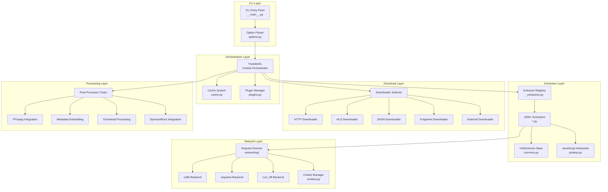
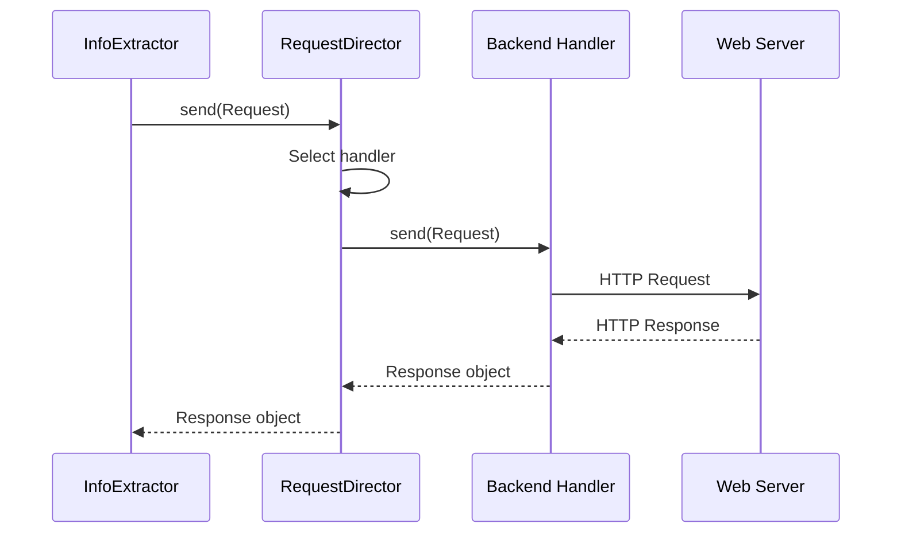
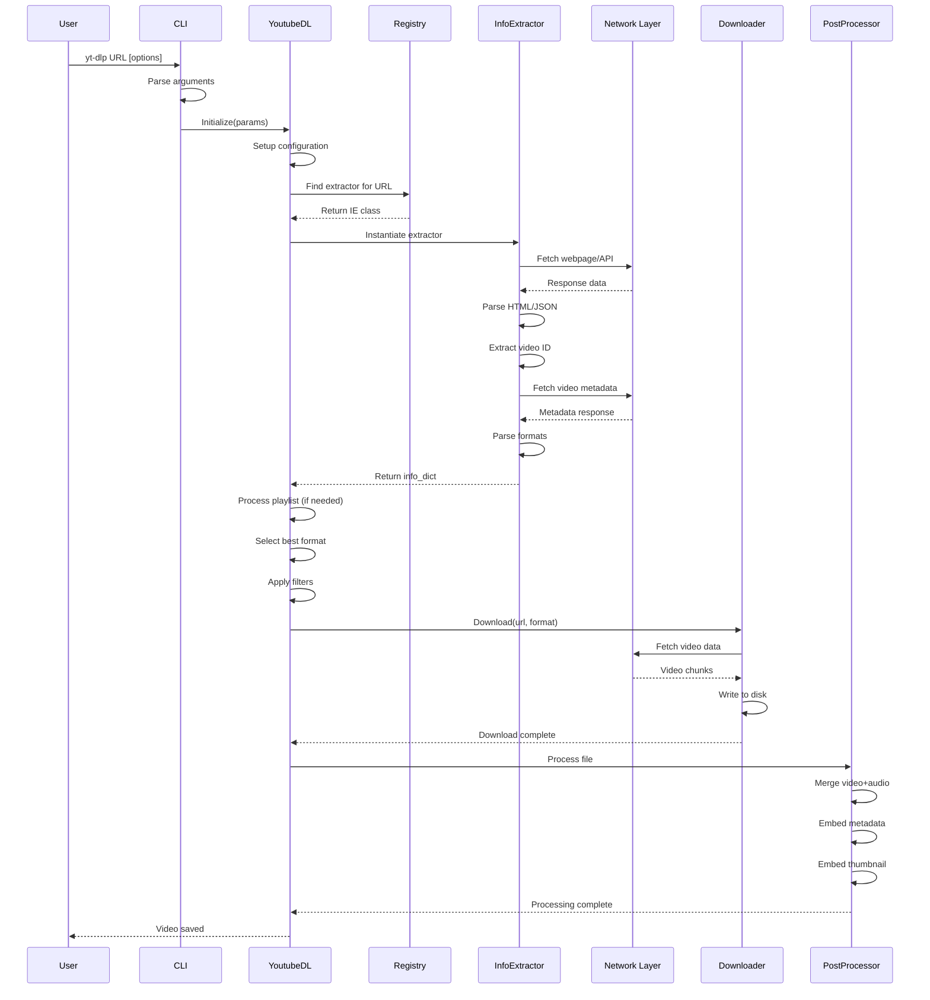

# Architecture

This document provides a detailed technical overview of yt-dlp's architecture, module organization, and data flow.

## Table of Contents

- [Overview](#overview)
- [Core Components](#core-components)
- [Module Organization](#module-organization)
- [Data Flow](#data-flow)
- [Design Patterns](#design-patterns)
- [Component Interaction](#component-interaction)

---

## Overview

yt-dlp follows a modular, layered architecture that separates concerns:

1. **CLI Layer** - User interface and argument parsing
2. **Orchestration Layer** - YoutubeDL class coordinates all operations
3. **Extraction Layer** - Site-specific extractors parse metadata
4. **Network Layer** - HTTP backend abstraction
5. **Download Layer** - Protocol-specific downloaders
6. **Processing Layer** - Post-processing pipeline



---

## Core Components

### 1. YoutubeDL Class

**Location**: `yt_dlp/YoutubeDL.py` (4,504 lines)

The central orchestrator managing the entire download process.

**Key Responsibilities**:
- Initialize configuration from CLI options
- Select appropriate extractor for URL
- Manage format selection and filtering
- Coordinate download process
- Execute post-processor chain
- Handle errors and retries
- Progress reporting
- Archive management

**Key Methods**:
```python
class YoutubeDL:
    def __init__(self, params=None):
        """Initialize with configuration parameters"""

    def download(self, url_list):
        """Download videos from URL list"""

    def extract_info(self, url, download=True):
        """Extract info dict from URL"""

    def process_ie_result(self, ie_result, download=True):
        """Process extractor result"""

    def process_info(self, info_dict):
        """Process single video info"""

    def select_format(self, format_spec, available_formats):
        """Select best format based on user preference"""

    def process_video_result(self, info_dict):
        """Process and download video"""
```

**Configuration Storage**:
The YoutubeDL class stores configuration in `self.params`, a dictionary containing:
- Format preferences
- Output templates
- Subtitle options
- Authentication credentials
- Network settings
- Post-processor options

**Code Example** - Initialization:
```python
# From yt_dlp/YoutubeDL.py:200-250
class YoutubeDL:
    def __init__(self, params=None):
        # Store parameters
        self.params = params or {}

        # Initialize components
        self._download_retcode = 0
        self._num_downloads = 0
        self._playlist_level = 0
        self._playlist_urls = set()
        self.cache = Cache(self)

        # Setup logging
        self._setup_opener()

        # Load plugins
        if self.params.get('load_plugins'):
            load_all_plugins()
```

[View YoutubeDL class](https://github.com/yt-dlp/yt-dlp/blob/master/yt_dlp/YoutubeDL.py#L199)

---

### 2. InfoExtractor Base Class

**Location**: `yt_dlp/extractor/common.py` (InfoExtractor class)

Base class for all extractors providing common functionality.

**Key Responsibilities**:
- URL pattern matching (`_VALID_URL`)
- HTTP request handling
- HTML/JSON parsing utilities
- Subtitle extraction
- Format parsing (HLS, DASH, SMIL)
- Error handling
- Test case management

**Class Structure**:
```python
class InfoExtractor:
    # Class attributes
    _VALID_URL = r'...'          # Regex to match URLs
    _WORKING = True              # Whether extractor is functional
    _NETRC_MACHINE = None        # Netrc machine name for auth
    IE_NAME = 'extractor_name'   # Identifier
    IE_DESC = 'Description'      # Human-readable description
    _TESTS = [...]               # Test cases

    def _real_extract(self, url):
        """Override this method in subclasses"""
        raise NotImplementedError('This method must be implemented')

    # Utility methods provided to subclasses
    def _download_webpage(self, url, video_id):
        """Download and return webpage content"""

    def _search_regex(self, pattern, string, name):
        """Search for pattern and extract result"""

    def _html_search_meta(self, name, html):
        """Extract meta tag content"""

    def _extract_m3u8_formats(self, m3u8_url, video_id):
        """Parse HLS playlist"""

    def _extract_mpd_formats(self, mpd_url, video_id):
        """Parse DASH manifest"""
```

**URL Matching Process**:
```python
# From yt_dlp/extractor/common.py
@classmethod
def suitable(cls, url):
    """Check if extractor can handle URL"""
    return re.match(cls._VALID_URL, url) is not None

@classmethod
def _match_id(cls, url):
    """Extract ID from URL"""
    match = re.match(cls._VALID_URL, url)
    return match.group('id')
```

[View InfoExtractor class](https://github.com/yt-dlp/yt-dlp/blob/master/yt_dlp/extractor/common.py#L107)

---

### 3. Extractor Registry

**Location**: `yt_dlp/extractor/_extractors.py`

Central registry importing and exposing all extractors.

**Purpose**:
- Lazy loading of extractors for performance
- Discovery mechanism for YoutubeDL
- Plugin extractor integration

**Structure**:
```python
# From yt_dlp/extractor/_extractors.py
from .youtube import YoutubeIE, YoutubeTabIE, YoutubePlaylistIE
from .vimeo import VimeoIE, VimeoChannelIE
from .soundcloud import SoundCloudIE, SoundCloudSetIE
# ... 1000+ imports

# Lazy extractor generation (optional)
def _build_lazy_ie(extractor_name):
    """Build lazy-loading wrapper for extractor"""
    def lazy_ie(*args, **kwargs):
        module = importlib.import_module(f'.{module_name}', 'yt_dlp.extractor')
        return getattr(module, extractor_name)(*args, **kwargs)
    return lazy_ie
```

**Extractor Selection** in YoutubeDL:
```python
# Pseudocode for extractor selection
def get_extractor_for_url(url):
    for ie_class in gen_extractor_classes():
        if ie_class.suitable(url):
            return ie_class()
    # No match found, use GenericIE as fallback
    return GenericIE()
```

---

### 4. Network Layer

**Location**: `yt_dlp/networking/`

Abstraction layer over HTTP backends providing:
- Multiple backend support (urllib, requests, curl_cffi)
- Request/response handling
- Cookie management
- Proxy support
- Browser impersonation
- WebSocket support

**RequestDirector** - Central HTTP handler:
```python
# From yt_dlp/networking/common.py
class RequestDirector:
    def __init__(self, logger, verbose=False):
        self._handlers = []  # List of request handlers
        self._verbose = verbose

    def send(self, request):
        """Send HTTP request using appropriate handler"""
        for handler in self._handlers:
            if handler.supports(request):
                return handler.send(request)
        raise NoSupportingHandlers('No handler for request')
```

**Backend Selection**:
- `urllib` - Default, standard library
- `requests` - Popular third-party library
- `curl_cffi` - Browser impersonation via libcurl

**Request Flow**:


---

### 5. Downloader Layer

**Location**: `yt_dlp/downloader/`

Protocol-specific downloaders handle actual file transfers.

**Downloader Hierarchy**:
```python
# Base downloader
class FileDownloader:
    def __init__(self, ydl, params):
        self.ydl = ydl
        self.params = params

    def download(self, filename, info_dict):
        """Override in subclasses"""
        raise NotImplementedError()

# Protocol-specific downloaders
class HttpFD(FileDownloader):
    """HTTP/HTTPS downloads"""

class HlsFD(FileDownloader):
    """HLS streaming downloads"""

class DashFD(FileDownloader):
    """DASH streaming downloads"""

class FragmentFD(FileDownloader):
    """Fragment-based downloads with resume"""

class ExternalFD(FileDownloader):
    """External downloader (aria2c, wget, curl)"""
```

**Downloader Selection Logic**:
```python
# From yt_dlp/downloader/__init__.py
def get_suitable_downloader(info_dict, params):
    """Select downloader based on protocol"""
    protocol = determine_protocol(info_dict)

    # Map protocols to downloaders
    downloaders = {
        'http': HttpFD,
        'https': HttpFD,
        'm3u8': HlsFD,
        'm3u8_native': HlsFD,
        'mpd': DashFD,
        'rtmp': RtmpFD,
    }

    # External downloader override
    external = params.get('external_downloader')
    if external:
        return ExternalFD

    return downloaders.get(protocol, HttpFD)
```

---

### 6. Post-Processor Layer

**Location**: `yt_dlp/postprocessor/`

Chain of post-processors transforming downloaded media.

**Base Post-Processor**:
```python
# From yt_dlp/postprocessor/common.py
class PostProcessor:
    def __init__(self, downloader=None):
        self._downloader = downloader

    def run(self, info):
        """Process file, return (info, [new_files])"""
        return [], info

    def to_screen(self, message):
        """Output message to user"""
        if self._downloader:
            self._downloader.to_screen(message)
```

**Common Post-Processors**:
- **FFmpegMergerPP** - Merge video+audio
- **FFmpegVideoConvertorPP** - Convert video format
- **FFmpegExtractAudioPP** - Extract audio track
- **EmbedThumbnailPP** - Embed thumbnail in file
- **MetadataParserPP** - Modify metadata
- **SponsorBlockPP** - Remove sponsored segments
- **MoveFilesAfterDownloadPP** - Move to final location

**Post-Processor Chain Execution**:


**Chain Execution**:
```python
# Pseudocode from YoutubeDL
def run_all_pps(self, info_dict):
    """Execute post-processor chain"""
    for pp in self._pps:
        info_dict = pp.run(info_dict)
        if info_dict is None:
            break  # PP deleted the file
    return info_dict
```

---

## Module Organization

### Directory Structure

```
yt_dlp/
├── __init__.py              # Entry point (1,114 lines)
│                            # Contains main() function
│
├── __main__.py              # Module execution entry
│                            # Calls main() from __init__.py
│
├── YoutubeDL.py             # Core orchestrator (4,504 lines)
│                            # Central class coordinating all operations
│
├── options.py               # CLI argument parsing (100KB)
│                            # Defines 100+ command-line options
│
├── version.py               # Version information
│
├── update.py                # Self-update functionality
│
├── cache.py                 # Caching system
│
├── cookies.py               # Cookie handling (browser extraction)
│
├── jsinterp.py              # JavaScript interpreter
│                            # Used for signature decryption
│
├── plugins.py               # Plugin system
│
├── aes.py                   # AES encryption/decryption
│
├── socks.py                 # SOCKS proxy support
│
├── webvtt.py                # WebVTT subtitle handling
│
├── extractor/               # Extraction layer (1000+ files)
│   ├── __init__.py          # Extractor initialization
│   ├── _extractors.py       # Central registry
│   ├── common.py            # InfoExtractor base class
│   ├── generic.py           # Fallback extractor
│   ├── youtube/             # YouTube multi-file extractor
│   │   ├── __init__.py
│   │   ├── _base.py         # Base YouTube functionality
│   │   ├── _video.py        # Video extraction
│   │   ├── _tab.py          # Playlists/channels
│   │   ├── _search.py       # Search results
│   │   └── ...
│   └── [site].py            # Site-specific extractors
│
├── downloader/              # Download layer
│   ├── __init__.py          # Downloader selection
│   ├── common.py            # Base downloader
│   ├── http.py              # HTTP/HTTPS downloads
│   ├── hls.py               # HLS streaming
│   ├── dash.py              # DASH streaming
│   ├── fragment.py          # Fragment-based downloads
│   ├── f4m.py               # Flash for Media
│   ├── rtmp.py              # RTMP streaming
│   └── external.py          # External downloader wrapper
│
├── postprocessor/           # Post-processing layer
│   ├── __init__.py          # PP initialization
│   ├── common.py            # Base post-processor
│   ├── ffmpeg.py            # FFmpeg integration (48KB)
│   ├── embedthumbnail.py    # Thumbnail embedding
│   ├── metadataparser.py    # Metadata manipulation
│   ├── modify_chapters.py   # Chapter modification
│   ├── sponsorblock.py      # SponsorBlock integration
│   └── ...
│
├── networking/              # Network layer
│   ├── __init__.py
│   ├── common.py            # Request/Response abstractions
│   ├── _urllib.py           # urllib backend
│   ├── _requests.py         # requests backend
│   ├── _curlcffi.py         # curl_cffi backend
│   ├── _websockets.py       # WebSocket support
│   ├── impersonate.py       # Browser impersonation
│   └── exceptions.py        # Network exceptions
│
└── utils/                   # Utility layer
    ├── __init__.py
    ├── _utils.py            # Core utilities (190KB)
    ├── traversal.py         # Data structure traversal
    ├── networking.py        # Network utilities
    ├── progress.py          # Progress reporting
    └── jslib/               # JavaScript library utilities
```

---

## Data Flow

### Complete Download Lifecycle



### Info Dictionary Flow

The info dictionary is the central data structure passed between components:

**Stage 1: Extractor Creates**
```python
{
    'id': 'abc123',
    'title': 'Video Title',
    'formats': [...],
    'thumbnails': [...],
    'subtitles': {...},
}
```

**Stage 2: YoutubeDL Enhances**
```python
{
    # ... original fields
    '_filename': '/path/to/output.mp4',
    'requested_formats': [video_format, audio_format],
    'format': 'bestvideo+bestaudio/best',
}
```

**Stage 3: Downloader Adds**
```python
{
    # ... previous fields
    'filepath': '/path/to/output.mp4',
    'downloaded_bytes': 50000000,
    'total_bytes': 50000000,
}
```

**Stage 4: Post-Processor Modifies**
```python
{
    # ... previous fields
    'filepath': '/final/path/output.mp4',  # May change during PP
    '__postprocessors_succeed': ['FFmpegMerger', 'EmbedThumbnail'],
}
```

---

## Design Patterns

### 1. Extractor Pattern

Each site gets a dedicated extractor class:

```python
class YouTubeIE(InfoExtractor):
    _VALID_URL = r'...'
    IE_NAME = 'youtube'

    def _real_extract(self, url):
        video_id = self._match_id(url)
        # YouTube-specific logic
        return info_dict

class VimeoIE(InfoExtractor):
    _VALID_URL = r'...'
    IE_NAME = 'vimeo'

    def _real_extract(self, url):
        video_id = self._match_id(url)
        # Vimeo-specific logic
        return info_dict
```

**Benefits**:
- Isolation of site-specific logic
- Easy to add new sites
- Independent testing
- Clear ownership

### 2. Strategy Pattern

Multiple implementations for protocols:

```python
# YoutubeDL selects strategy based on protocol
downloader = get_suitable_downloader(info_dict, params)
downloader.download(filename, info_dict)

# Different strategies:
# - HttpFD for direct downloads
# - HlsFD for HLS streams
# - DashFD for DASH manifests
# - FragmentFD for resumable fragments
```

### 3. Chain of Responsibility

Post-processors form a chain:

```python
# Each PP processes and passes to next
for pp in self._pps['post_process']:
    files_to_delete, info = pp.run(info)
    if info is None:
        break  # PP deleted file, stop chain
```

### 4. Template Method

`InfoExtractor` defines workflow, subclasses implement steps:

```python
class InfoExtractor:
    def extract(self, url):
        # Template method
        self._initialize()
        video_id = self._match_id(url)
        return self._real_extract(url)  # Subclass implements

    def _real_extract(self, url):
        raise NotImplementedError()  # Subclasses override
```

### 5. Factory Pattern

Extractor and downloader selection:

```python
# Factory for extractors
def get_info_extractor(ie_name):
    for ie_class in gen_extractor_classes():
        if ie_class.IE_NAME == ie_name:
            return ie_class()
    return None

# Factory for downloaders
def get_suitable_downloader(info_dict, params):
    protocol = determine_protocol(info_dict)
    return PROTOCOL_MAP[protocol](params)
```

---

## Component Interaction

### Extractor → Network Layer

```python
# From InfoExtractor
class InfoExtractor:
    def _download_webpage(self, url, video_id):
        """Download webpage via network layer"""
        request = Request(url, headers=self.geo_verification_headers())
        return self._downloader.urlopen(request).read().decode('utf-8')
```

### YoutubeDL → Extractor

```python
# From YoutubeDL
def extract_info(self, url, download=True):
    # Select extractor
    for ie_class in self._ies:
        if not ie_class.suitable(url):
            continue

        ie = ie_class(self)  # Pass YoutubeDL instance
        return ie.extract(url)
```

### Downloader → Network Layer

```python
# From downloader/http.py
class HttpFD(FileDownloader):
    def real_download(self, filename, info_dict):
        url = info_dict['url']
        request = Request(url, headers=self._prepare_headers())

        # Use network layer
        response = self.ydl.urlopen(request)

        # Stream to disk
        with open(filename, 'wb') as f:
            while True:
                chunk = response.read(10240)
                if not chunk:
                    break
                f.write(chunk)
```

### YoutubeDL → Post-Processors

```python
# From YoutubeDL
def run_all_pps(self, key, info, *, additional_pps=None):
    for pp in (additional_pps or []) + self._pps[key]:
        info = self.run_pp(pp, info)
    return info

def run_pp(self, pp, info):
    files_to_delete, info = pp.run(info)
    self.post_process_info(info, files_to_delete)
    return info
```

---

## Performance Considerations

### 1. Lazy Loading

Extractors can be lazy-loaded to improve startup time:

```bash
# Generate lazy extractors
python devscripts/make_lazy_extractors.py
```

This creates wrapper functions that import extractors only when needed.

### 2. Caching

Multiple cache levels:
- **HTTP Cache**: Response caching for repeated requests
- **OAuth Token Cache**: Avoid repeated authentication
- **Archive File**: Skip already-downloaded videos

### 3. Concurrent Fragments

Fragment-based downloaders fetch multiple fragments in parallel:

```python
# From downloader/fragment.py
with ThreadPoolExecutor(max_workers=self.params.get('concurrent_fragment_downloads', 1)) as pool:
    futures = [pool.submit(download_fragment, frag) for frag in fragments]
```

---

## Error Handling Strategy

### Exception Hierarchy

```python
YoutubeDLError                    # Base exception
├── ExtractorError                # Extraction failures
│   ├── UnsupportedError          # Unsupported feature
│   ├── RegexNotFoundError        # Regex didn't match
│   └── GeoRestrictedError        # Geo-restriction
├── DownloadError                 # Download failures
│   ├── ContentTooShortError      # Incomplete download
│   └── RequestError              # Network errors
└── PostProcessingError           # PP failures
```

### Error Recovery

```python
# From YoutubeDL
try:
    info = self.extract_info(url)
except GeoRestrictedError:
    self.report_error('Video is geo-restricted')
    return
except ExtractorError as e:
    self.report_error(str(e))
    return
except DownloadError as e:
    # Retry logic
    if self._num_retries < max_retries:
        time.sleep(retry_delay)
        return self.download(url)
    raise
```

---

## Next Steps

- [Python Features & Coding Style](python-features.md) - Learn about Python patterns used
- [Extractor Overview](extractors/00-overview.md) - Deep dive into extraction mechanics
- [Networking](networking.md) - Network layer details
- [Downloaders](downloaders.md) - Download protocol handlers
