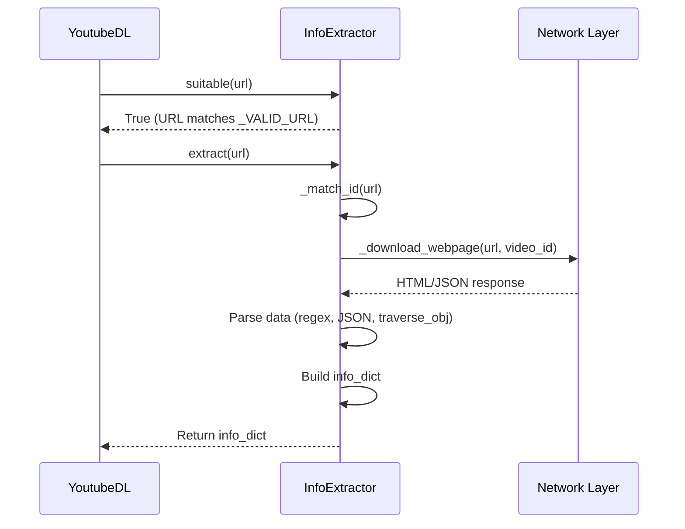

# Extractor Overview

How extractors work in yt-dlp and the anatomy of an information extractor.

## Table of Contents

- [What is an Extractor?](#what-is-an-extractor)
- [InfoExtractor Base Class](#infoextractor-base-class)
- [Extractor Lifecycle](#extractor-lifecycle)
- [URL Pattern Matching](#url-pattern-matching)
- [Info Dictionary Format](#info-dictionary-format)
- [Testing Extractors](#testing-extractors)

---

## What is an Extractor?

An **extractor** is a Python class that:
1. Matches URLs via regex pattern
2. Fetches webpage/API data
3. Parses metadata and video URLs
4. Returns standardized info dictionary

**Why separate extractors?** Each website has unique:
- URL structures
- HTML/JSON formats
- Authentication requirements
- API endpoints
- Video delivery methods

yt-dlp has **1000+ extractors** for different sites.

---

## InfoExtractor Base Class

All extractors inherit from `InfoExtractor`:

```python
# From yt_dlp/extractor/common.py
class InfoExtractor:
    """Information Extractor class.

    Information extractors are classes that, given a URL, extract
    information about the video (or videos) the URL refers to.
    """

    # Class attributes
    _VALID_URL = r'...'          # Regex to match URLs
    _WORKING = True              # Whether extractor is functional
    IE_NAME = 'site_name'        # Identifier
    IE_DESC = 'Site Name'        # Human-readable description
    _TESTS = [...]               # Test cases

    def _real_extract(self, url):
        """Override this method in subclasses"""
        raise NotImplementedError()
```

[View in code](https://github.com/yt-dlp/yt-dlp/blob/master/yt_dlp/extractor/common.py#L107)

---

## Extractor Lifecycle



### Step-by-Step Process

**1. URL Matching**
```python
@classmethod
def suitable(cls, url):
    """Check if extractor can handle URL"""
    return re.match(cls._VALID_URL, url) is not None
```

**2. ID Extraction**
```python
def _match_id(self, url):
    """Extract video ID from URL"""
    match = re.match(self._VALID_URL, url)
    return match.group('id')
```

**3. Data Fetching**
```python
def _real_extract(self, url):
    video_id = self._match_id(url)
    webpage = self._download_webpage(url, video_id)
    # or
    data = self._download_json(api_url, video_id)
```

**4. Parsing**
```python
# Regex extraction
title = self._html_search_regex(
    r'<h1[^>]*>([^<]+)</h1>',
    webpage, 'title')

# JSON traversal
title = traverse_obj(data, ('video', 'title'))

# Meta tag extraction
description = self._html_search_meta('description', webpage)
```

**5. Format Extraction**
```python
# Direct URL
formats = [{'url': video_url, 'ext': 'mp4'}]

# HLS manifest
formats = self._extract_m3u8_formats(
    m3u8_url, video_id, 'mp4')

# DASH manifest
formats = self._extract_mpd_formats(
    mpd_url, video_id)
```

**6. Return Info Dictionary**
```python
return {
    'id': video_id,
    'title': title,
    'description': description,
    'formats': formats,
    'thumbnail': thumbnail_url,
    'duration': duration,
}
```

---

## URL Pattern Matching

### `_VALID_URL` Regex

The `_VALID_URL` attribute defines what URLs the extractor handles:

```python
# Simple pattern
_VALID_URL = r'https?://(?:www\.)?example\.com/video/(?P<id>[0-9]+)'

# Multiple domains
_VALID_URL = r'https?://(?:www\.)?(?:example\.com|example\.net)/v/(?P<id>[a-zA-Z0-9_-]+)'

# Optional parts
_VALID_URL = r'https?://(?:www\.)?example\.com/(?:video/|v/)?(?P<id>[0-9]+)'

# Named groups for extraction
_VALID_URL = r'https?://(?P<domain>example\.(?:com|net))/(?P<type>video|live)/(?P<id>[0-9]+)'
```

### Match Examples

```python
# From yt_dlp/extractor/youtube.py
_VALID_URL = r'''(?x)^
    (
        (?:https?://|//)                                    # http(s):// or protocol-independent URL
        (?:(?:(?:(?:\w+\.)?[yY][oO][uU][tT][uU][bB][eE](?:-nocookie|kids)?\.com)|
           (?:www\.)?deturl\.com/www\.youtube\.com|
           (?:www\.)?pwnyoutube\.com|
           ...
        )/
        (?:.*?\#/)?                                         # anchor
        (?:                                                 # the various things that can precede the ID:
            (?:(?:v|embed|e|shorts|live)/(?!videoseries|live_stream))  # v/ or embed/ or e/ or shorts/
            |(?:                                            # or the v= param in all its forms
                ...
            )
        ))
    )?
    (?P<id>[0-9A-Za-z_-]{11})                              # Video ID
    ...
'''
```

---

## Info Dictionary Format

The info dictionary is the standard data structure returned by extractors:

### Required Fields

```python
{
    'id': 'video_id',        # Video identifier (string)
    'title': 'Video Title',  # Video title (string, never None)
}
```

### Common Optional Fields

```python
{
    # Media
    'url': 'https://...',           # Direct video URL
    'formats': [...],               # List of format dictionaries
    'ext': 'mp4',                   # File extension

    # Metadata
    'description': 'Description',
    'thumbnail': 'https://...',     # Thumbnail URL
    'duration': 120,                # Duration in seconds
    'timestamp': 1234567890,        # Unix timestamp
    'upload_date': '20201225',      # YYYYMMDD format

    # Uploader info
    'uploader': 'Channel Name',
    'uploader_id': 'channel_id',
    'uploader_url': 'https://...',
    'channel': 'Channel Name',
    'channel_id': 'channel_id',

    # Stats
    'view_count': 1000,
    'like_count': 100,
    'dislike_count': 5,
    'comment_count': 50,

    # Categorization
    'categories': ['Music', 'Entertainment'],
    'tags': ['tag1', 'tag2'],
    'age_limit': 18,

    # Playlist info (if part of playlist)
    'playlist': 'Playlist Name',
    'playlist_id': 'playlist_id',
    'playlist_index': 1,

    # Subtitles
    'subtitles': {
        'en': [{
            'url': 'https://...',
            'ext': 'srt',
        }],
    },

    # Technical
    'protocol': 'https',
    'is_live': False,
    'was_live': False,
}
```

### Format Dictionary Structure

```python
{
    'url': 'https://...',           # Media URL (required)
    'format_id': '1080p',           # Identifier
    'ext': 'mp4',                   # Extension

    # Video properties
    'width': 1920,
    'height': 1080,
    'fps': 30,
    'vcodec': 'h264',               # Video codec
    'vbr': 2500,                    # Video bitrate (kbps)

    # Audio properties
    'acodec': 'aac',                # Audio codec
    'abr': 128,                     # Audio bitrate (kbps)
    'asr': 48000,                   # Audio sampling rate

    # Quality hints
    'quality': 1,                   # Quality ranking
    'preference': 1,                # Preference over other formats
    'tbr': 2628,                    # Total bitrate

    # Technical
    'filesize': 50000000,           # File size in bytes
    'protocol': 'https',            # Download protocol
    'format_note': 'Premium',       # Human-readable note

    # HLS/DASH specific
    'manifest_url': 'https://...',  # Manifest URL
    'fragments': [...],             # Fragment list
}
```

---

## Testing Extractors

### Test Structure

```python
class MySiteIE(InfoExtractor):
    _TESTS = [{
        'url': 'https://mysite.com/video/12345',
        'md5': 'abc123...',  # MD5 of downloaded file
        'info_dict': {
            'id': '12345',
            'ext': 'mp4',
            'title': 'Test Video',
            'description': 'Test description',
            'uploader': 'Test User',
            'duration': 120,
        },
    }]
```

### Running Tests

```bash
# Test specific extractor
python test/test_download.py TestDownload.test_MySite_0

# Test with verbose output
python test/test_download.py TestDownload.test_MySite_0 -v
```

See [Testing Methodology](../testing.md) for details.

---

## Helper Methods

### HTTP Requests

```python
# Download webpage
webpage = self._download_webpage(url, video_id)

# Download JSON
data = self._download_json(api_url, video_id)

# Download XML
xml = self._download_xml(url, video_id)

# HEAD request
response = self._request_webpage(HEADRequest(url), video_id)
```

### HTML Parsing

```python
# Search for regex pattern
title = self._html_search_regex(
    r'<h1>(.+?)</h1>',
    webpage, 'title')

# Search meta tags
description = self._html_search_meta(
    'description', webpage)

# Extract multiple values
values = self._html_search_regex(
    r'<span class="value">(.+?)</span>',
    webpage, 'values', group=1, default=None)
```

### JSON/Data Extraction

```python
# Safe nested access
title = traverse_obj(data, ('video', 'title'))

# Multiple path attempts
video_id = traverse_obj(data,
    ('data', 'id'),           # Try first
    ('video', 'videoId'),     # Then try second
    default='unknown')        # Fallback

# Type validation
duration = traverse_obj(data,
    ('video', 'duration'),
    expected_type=int)
```

### Format Extraction

```python
# HLS (m3u8)
formats = self._extract_m3u8_formats(
    m3u8_url, video_id, 'mp4',
    m3u8_id='hls', fatal=False)

# DASH (mpd)
formats = self._extract_mpd_formats(
    mpd_url, video_id, mpd_id='dash', fatal=False)

# SMIL
formats = self._extract_smil_formats(
    smil_url, video_id)
```

---

## Common Patterns

### Pattern 1: Simple HTML Extraction

```python
def _real_extract(self, url):
    video_id = self._match_id(url)
    webpage = self._download_webpage(url, video_id)

    title = self._html_search_regex(r'<h1>(.+?)</h1>', webpage, 'title')
    video_url = self._html_search_regex(r'src="(.+?\.mp4)"', webpage, 'video URL')

    return {
        'id': video_id,
        'title': title,
        'url': video_url,
    }
```

### Pattern 2: JSON API Extraction

```python
def _real_extract(self, url):
    video_id = self._match_id(url)
    data = self._download_json(f'https://api.site.com/video/{video_id}', video_id)

    return {
        'id': video_id,
        'title': traverse_obj(data, ('video', 'title')),
        'formats': self._extract_m3u8_formats(
            traverse_obj(data, ('video', 'playback_url')),
            video_id, 'mp4'),
    }
```

### Pattern 3: Multiple Format Extraction

```python
def _real_extract(self, url):
    video_id = self._match_id(url)
    data = self._download_json(api_url, video_id)

    formats = []
    for fmt in data['formats']:
        formats.append({
            'url': fmt['url'],
            'format_id': fmt['quality'],
            'height': fmt.get('height'),
            'ext': fmt.get('ext', 'mp4'),
        })

    return {
        'id': video_id,
        'title': data['title'],
        'formats': formats,
    }
```

---

## Next Steps

Explore extractor examples by complexity:

**Beginner**:
- [Simple Example](01-simple-example.md) - Minimal extractor (7 lines!)

**Intermediate**:
- [SoundCloud](05-soundcloud.md) - Dynamic client ID extraction
- [Archive.org](11-archiveorg.md) - Multi-format handling
- [Kaltura](10-kaltura.md) - Embeddable platform

**Advanced**:
- [YouTube](02-youtube.md) - Production-grade complexity (8,000+ lines)
- [Twitter](03-twitter.md) - GraphQL + JavaScript interpretation
- [Twitch](04-twitch.md) - Live streaming
- [Generic](12-generic.md) - Intelligent fallback extractor

**Specialized Techniques**:
- [TikTok](06-tiktok.md) - Device emulation
- [Vimeo](07-vimeo.md) - OAuth/JWT tokens
- [HotStar](08-hotstar.md) - DRM/Widevine
- [CDA](09-cda.md) - Custom encryption

---

[← Back to Documentation](../README.md)
