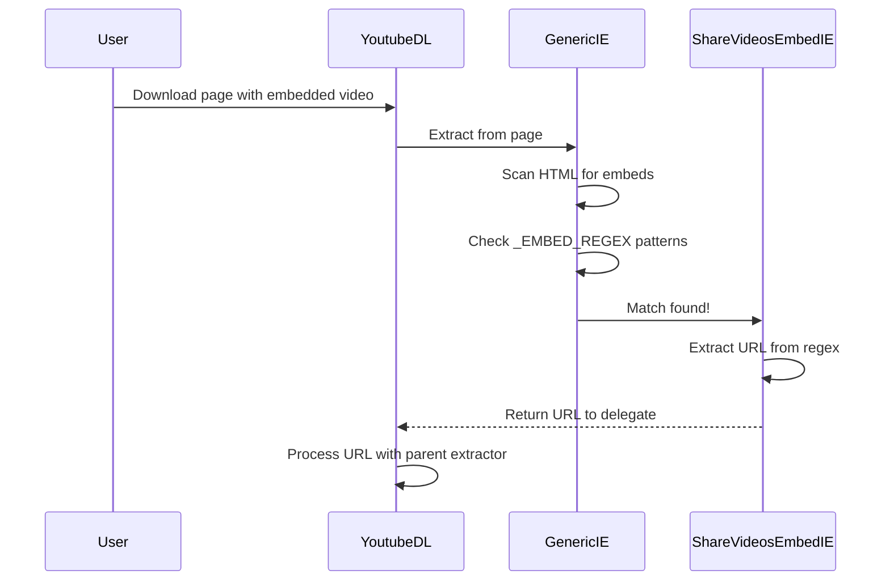

# Simple Extractor Example: ShareVideosEmbed

The minimal extractor - understanding yt-dlp extractors through the simplest possible implementation.

## Overview

**File**: `yt_dlp/extractor/sharevideos.py`
**Lines**: 7 lines total (smallest extractor in yt-dlp!)
**Complexity**: Beginner
**Key Concept**: Embed-only extractor using `_EMBED_REGEX`

[View source code](https://github.com/yt-dlp/yt-dlp/blob/master/yt_dlp/extractor/sharevideos.py)

---

## Complete Source Code

```python
from .common import InfoExtractor


class ShareVideosEmbedIE(InfoExtractor):
    _VALID_URL = False
    _EMBED_REGEX = [r'<iframe[^>]+?\bsrc\s*=\s*(["\'])(?P<url>(?:https?:)?//embed\.share-videos\.se/auto/embed/\d+\?.*?\buid=\d+.*?)\1']
```

That's it! The entire extractor in 7 lines.

---

## Line-by-Line Analysis

### Line 1-2: Import

```python
from .common import InfoExtractor
```

**Purpose**: Import the base class all extractors inherit from.

**What is InfoExtractor?**
- Provides HTTP request methods (`_download_webpage`, etc.)
- Handles error reporting
- Manages cookies and authentication
- Provides parsing utilities

---

### Line 5: Class Definition

```python
class ShareVideosEmbedIE(InfoExtractor):
```

**Naming Convention**: `[SiteName][Type]IE`
- `ShareVideos` - Site name
- `Embed` - This extractor specifically handles embeds
- `IE` - Info Extractor suffix

**Why separate embed extractors?** Some sites have:
- Different URLs for embeds vs direct links
- Different HTML structure in embed pages
- Different authentication requirements

---

### Line 6: `_VALID_URL = False`

```python
_VALID_URL = False
```

**What does this mean?**
This extractor **does NOT match any direct URLs**.

**Normal extractors** have a regex pattern:
```python
_VALID_URL = r'https?://example\.com/video/(?P<id>[0-9]+)'
```

**Embed extractors** set `_VALID_URL = False` because they're only invoked when:
1. Another extractor finds an embed iframe
2. The Generic extractor scans a webpage for embeds

---

### Line 7: `_EMBED_REGEX`

```python
_EMBED_REGEX = [r'<iframe[^>]+?\bsrc\s*=\s*(["\'])(?P<url>(?:https?:)?//embed\.share-videos\.se/auto/embed/\d+\?.*?\buid=\d+.*?)\1']
```

**Purpose**: Detect share-videos.se embeds in webpages.

Let's break down this regex:

```regex
<iframe                          # Iframe tag
[^>]+?                           # Any attributes (non-greedy)
\bsrc\s*=\s*                     # src attribute with optional spaces
(["\'])                          # Quote (capture group 1)
(?P<url>                         # Named group "url" starts
  (?:https?:)?                   # Optional protocol
  //embed\.share-videos\.se      # Domain
  /auto/embed/\d+                # Path with numeric ID
  \?.*?\buid=\d+.*?              # Query string with uid parameter
)                                # Named group "url" ends
\1                               # Matching quote from group 1
```

**Example HTML this matches**:
```html
<iframe src="https://embed.share-videos.se/auto/embed/12345?uid=67890" width="640" height="360"></iframe>
```

**Captured URL**: `https://embed.share-videos.se/auto/embed/12345?uid=67890`

---

## How It Works

### Extraction Flow



### Step-by-Step

1. **User visits a page** with share-videos.se embed:
   ```html
   <html>
     <body>
       <iframe src="https://embed.share-videos.se/auto/embed/12345?uid=67890"></iframe>
     </body>
   </html>
   ```

2. **GenericIE scans** for embeds using all registered `_EMBED_REGEX` patterns

3. **ShareVideosEmbedIE regex matches** the iframe

4. **URL is extracted**: `https://embed.share-videos.se/auto/embed/12345?uid=67890`

5. **yt-dlp processes** the extracted URL with the parent `ShareVideosIE` extractor (not shown in this simple example)

---

## Key Concepts Demonstrated

### 1. Embed-Only Extractors

**Pattern**: `_VALID_URL = False` + `_EMBED_REGEX`

**Use when**:
- Site has separate embed URLs
- Embeds appear on third-party sites
- Only need to detect embeds, not handle direct URLs

**Other examples**:
- `VimeoEmbedIE`
- `YouTubeEmbedIE`
- `DailymotionEmbedIE`

### 2. Minimal Implementation

This extractor has **no `_real_extract()` method**!

**Why?** It delegates extraction to the parent extractor:
- Detects embed → Extracts URL → Passes to `ShareVideosIE`
- No need to duplicate extraction logic

### 3. Regex-Based Detection

**Pattern matching is crucial** for extractors:
- URL patterns (`_VALID_URL`)
- Embed detection (`_EMBED_REGEX`)
- Data extraction from HTML

---

## Comparison: Full vs Embed Extractor

### Full Extractor (Hypothetical ShareVideosIE)

```python
class ShareVideosIE(InfoExtractor):
    _VALID_URL = r'https?://share-videos\.se/(?:video/)?(?P<id>\d+)'

    def _real_extract(self, url):
        video_id = self._match_id(url)
        webpage = self._download_webpage(url, video_id)

        video_url = self._search_regex(
            r'file:\s*"([^"]+)"',
            webpage, 'video URL')

        title = self._html_search_meta('title', webpage)

        return {
            'id': video_id,
            'title': title,
            'url': video_url,
        }
```

### Embed Extractor (Actual ShareVideosEmbedIE)

```python
class ShareVideosEmbedIE(InfoExtractor):
    _VALID_URL = False
    _EMBED_REGEX = [r'<iframe[^>]+?\bsrc\s*=\s*(["\'])(?P<url>(?:https?:)?//embed\.share-videos\.se/auto/embed/\d+\?.*?\buid=\d+.*?)\1']
```

**Embed extractor is much simpler** - just detect and extract the URL!

---

## Testing

### Manual Test

```bash
# This won't work directly (embed-only)
yt-dlp 'https://embed.share-videos.se/auto/embed/12345?uid=67890'

# Works when embedded in a page
yt-dlp 'https://example.com/page-with-share-videos-embed'
```

### Test Code

```python
_TESTS = [{
    # Not included in actual extractor (too simple)
    # But would look like:
    'url': 'https://example.com/page-with-embed',
    'info_dict': {
        'id': '12345',
        'ext': 'mp4',
        'title': 'Embedded Video',
    },
}]
```

---

## When to Use This Pattern

**Use embed-only extractors when**:
1. ✅ Videos are primarily embedded on other sites
2. ✅ Embed URLs have different structure than direct URLs
3. ✅ Detection is simple (regex pattern)
4. ✅ Actual extraction is handled by parent extractor

**Don't use when**:
1. ❌ Need custom extraction logic for embeds
2. ❌ Embed URLs are same as direct URLs
3. ❌ Complex authentication required

---

## Real-World Usage

### Where ShareVideos Embeds Appear

Share-videos.se is a Swedish video hosting service. Embeds typically appear on:
- News websites
- Blogs
- Social media embeds
- Third-party pages

### Example Embed HTML

```html
<!DOCTYPE html>
<html>
<head>
    <title>News Article</title>
</head>
<body>
    <h1>Breaking News</h1>
    <p>Watch the video below:</p>

    <!-- ShareVideos Embed -->
    <iframe
        src="https://embed.share-videos.se/auto/embed/12345?uid=67890"
        width="640"
        height="360"
        frameborder="0"
        allowfullscreen>
    </iframe>

    <p>More article content...</p>
</body>
</html>
```

**yt-dlp command**:
```bash
yt-dlp 'https://news-site.com/article/breaking-news'
```

**Output**:
```
[generic] Extracting URL: https://news-site.com/article/breaking-news
[generic] Searching for embeds
[ShareVideosEmbed] Found embed: https://embed.share-videos.se/auto/embed/12345?uid=67890
[ShareVideos] Extracting: 12345
[download] Destination: Breaking News-12345.mp4
```

---

## Key Takeaways

1. **Minimal viable extractor** = 7 lines
2. **Embed detection** via `_EMBED_REGEX`
3. **No direct URL matching** with `_VALID_URL = False`
4. **Delegation pattern** - detect embeds, don't extract content
5. **Regex is powerful** for pattern matching

---

## Next Steps

**More Complex Examples**:

- [Extractor Overview](00-overview.md) - Full extractor anatomy
- [SoundCloud](05-soundcloud.md) - Dynamic API credentials
- [Generic Extractor](12-generic.md) - Universal fallback (most complex)

**Learn About**:

- [Testing](../testing.md) - How to test extractors
- [Development Guide](../development.md) - Create your own extractor
- [Python Features](../python-features.md) - Regex and pattern matching

---

[← Back to Extractors](00-overview.md) | [Next: YouTube →](02-youtube.md)
