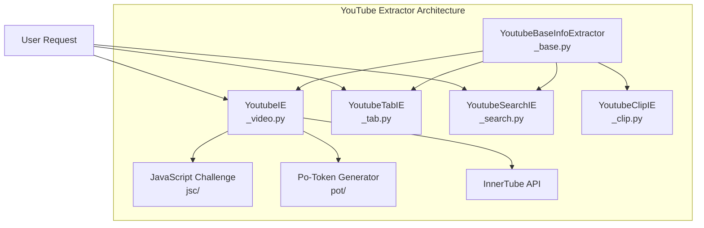
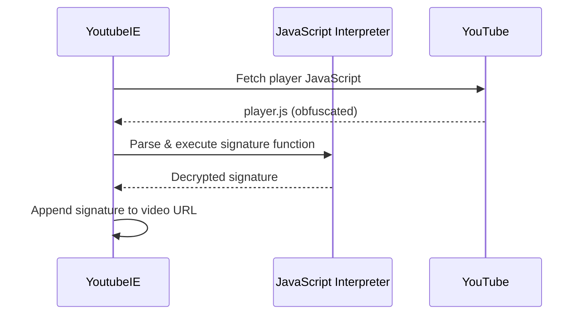

# YouTube Extractor

The most complex and production-grade extractor in yt-dlp - a complete reference implementation.

## Overview

**Files**: 9 Python files (8,783 lines)
**Complexity**: Very Complex (Production-Grade)
**Architecture**: Multi-file, modular design
**Key Features**:
- InnerTube API integration
- JavaScript signature decryption
- Po-token bot detection bypass
- Multiple client types (web, android, iOS, TV)
- Live stream support
- Age-gate handling
- Subtitle extraction

[View source code](https://github.com/yt-dlp/yt-dlp/tree/master/yt_dlp/extractor/youtube)

---

## File Structure

```
yt_dlp/extractor/youtube/
├── __init__.py           (50 lines)   - Module exports
├── _base.py              (1,317 lines) - Base class & InnerTube API
├── _video.py             (4,355 lines) - Main video extraction
├── _tab.py               (2,411 lines) - Playlists, channels, tabs
├── _search.py            (167 lines)   - Search functionality
├── _clip.py              (68 lines)    - YouTube Clips
├── _redirect.py          (248 lines)   - URL redirects & shortcuts
├── _mistakes.py          (69 lines)    - Common URL mistakes
├── _notifications.py     (98 lines)    - Notifications page
├── jsc/                              - JavaScript challenge solver
└── pot/                              - Po-token generator
```

**Total**: 8,783 lines of highly specialized code

---

## Architecture Overview



---

## Key Components

### 1. YoutubeBaseInfoExtractor (_base.py)

**Purpose**: Common functionality for all YouTube extractors

**Key Features**:
- InnerTube API client management
- Authentication handling
- Po-token generation
- Cookie management
- Common utilities

**InnerTube API Clients**:
```python
# Different clients for different purposes
_CLIENTS = {
    'web': {...},          # Standard web client
    'web_music': {...},    # YouTube Music
    'web_embedded': {...}, # Embed player
    'web_creator': {...},  # Creator Studio
    'android': {...},      # Android app
    'android_music': {...},# Android Music app
    'android_creator': {...}, # Android Creator
    'ios': {...},          # iOS app
    'ios_music': {...},    # iOS Music app
    'tv_embedded': {...},  # TV embed player
}
```

**Why multiple clients?**
- Different clients expose different formats
- Some clients bypass age restrictions
- Fallback when one client is blocked
- Access to special features (live DVR, premium formats)

---

### 2. YoutubeIE (_video.py) - Main Video Extractor

**Purpose**: Extract individual video information

**URL Patterns Supported**:
```python
# Standard watch URLs
https://www.youtube.com/watch?v=VIDEO_ID
https://youtube.com/watch?v=VIDEO_ID
https://m.youtube.com/watch?v=VIDEO_ID

# Short URLs
https://youtu.be/VIDEO_ID
https://www.youtube.com/embed/VIDEO_ID
https://www.youtube.com/v/VIDEO_ID

# Shorts
https://www.youtube.com/shorts/VIDEO_ID

# Live streams
https://www.youtube.com/live/VIDEO_ID
```

**Extraction Process**:

1. **Extract Video ID** from URL
2. **Try multiple API clients** (web, android, iOS)
3. **Handle JavaScript challenges** if detected
4. **Generate po-token** if needed (bot detection bypass)
5. **Decrypt signatures** if required
6. **Parse streaming data** (DASH, HLS manifests)
7. **Extract subtitles** (manual + auto-generated)
8. **Build format list** with quality preferences

---

### 3. JavaScript Signature Decryption

**Problem**: YouTube obfuscates video URLs with signatures

**Solution**: yt-dlp includes a JavaScript interpreter

**Process**:


**Code Example** (simplified):
```python
# From _video.py
def _decrypt_signature(self, s, video_id, player_url):
    """Decrypt YouTube signature"""
    player_id = self._extract_player_id(player_url)

    # Cache player functions
    if player_id not in self._player_cache:
        player_code = self._download_webpage(
            player_url, video_id,
            note='Downloading player %s' % player_id)

        # Parse JavaScript functions
        self._player_cache[player_id] = self._parse_sig_js(player_code)

    # Execute decryption function
    return self._player_cache[player_id](s)
```

---

### 4. Po-Token Generation

**Problem**: YouTube detects bots and blocks requests

**Solution**: Generate "po-token" (proof of origin token)

**What is po-token?**
- Cryptographic token proving the request comes from a real browser
- Generated via complex JavaScript challenge
- Required for some videos/formats

**Implementation**:
- Located in `pot/` subdirectory
- Executes JavaScript challenges
- Caches tokens for reuse
- Falls back to alternative clients if generation fails

---

### 5. Format Selection & Merging

YouTube serves video and audio separately (DASH):

**Format Types**:
```python
# Video-only formats
{
    'format_id': '137',
    'ext': 'mp4',
    'height': 1080,
    'vcodec': 'avc1.640028',
    'acodec': 'none',  # No audio!
}

# Audio-only formats
{
    'format_id': '140',
    'ext': 'm4a',
    'acodec': 'mp4a.40.2',
    'vcodec': 'none',  # No video!
}
```

**yt-dlp automatically merges** video+audio using FFmpeg:
```bash
# User sees this as single format
bestvideo[ext=mp4]+bestaudio[ext=m4a]/best
```

---

## Complex URL Patterns

YouTube has incredibly complex URL matching:

```python
_VALID_URL = r'''(?x)^
    (
        (?:https?://|//)              # Protocol
        (?:(?:(?:(?:\w+\.)?[yY][oO][uU][tT][uU][bB][eE](?:-nocookie|kids)?\.com)|
           (?:www\.)?deturl\.com/www\.youtube\.com|
           (?:www\.)?pwnyoutube\.com|
           (?:www\.)?hooktube\.com|
           (?:www\.)?yourepeat\.com|
           (?:www\.)?youtube\.googleapis\.com)/
        (?:.*?\#/)?
        (?:
            (?:(?:v|embed|e|shorts|live)/(?!videoseries|live_stream))
            |(?:
                (?:(?:watch|movie)(?:_popup)?(?:\.php)?/?)?
                (?:\?|\#!?)
                (?:.*?[&;])??
                v=
            )
        ))
    )?
    (?P<id>[0-9A-Za-z_-]{11})  # Video ID (11 characters)
    ...
'''
```

**Supports**:
- youtube.com, youtu.be, m.youtube.com
- youtube-nocookie.com, youtubek ids.com
- Third-party sites (hooktube, deturl, etc.)
- Various URL formats (/watch?v=, /embed/, /v/, /shorts/)

---

## Age-Restricted Content

**Challenge**: Age-restricted videos require sign-in

**Solutions**:

1. **Use cookies from browser**:
   ```bash
   yt-dlp --cookies-from-browser chrome 'URL'
   ```

2. **Try embed player** (sometimes bypasses age-gate):
   ```python
   # Automatically attempted
   clients = ['web', 'web_embedded', 'android']
   ```

3. **Use TV client** (often works):
   ```python
   player_client = 'tv_embedded'
   ```

---

## Live Stream Support

**Features**:
- Live stream detection
- DVR support (rewind live streams)
- Post-live VOD access
- Live chat download (separate extractor)

**Handling**:
```python
# Detect live status
if video_details.get('isLive'):
    info_dict['is_live'] = True

# Handle live formats
if is_live:
    formats = self._extract_m3u8_formats(
        streaming_data['hlsManifestUrl'],
        video_id, 'mp4', m3u8_id='hls', live=True)
```

---

## Subtitles

**Types Extracted**:
1. **Manual subtitles** (uploaded by creator)
2. **Auto-generated captions** (speech-to-text)
3. **Translated captions** (auto-translated)

**Formats**:
- VTT (WebVTT)
- TTML (Timed Text)
- SRV1, SRV2, SRV3 (YouTube formats)
- Converted to SRT

**Languages**: All available languages extracted

---

## Error Handling

**Comprehensive error handling** for:

1. **Video unavailable**:
   ```python
   if 'playabilityStatus' in player_response:
       status = player_response['playabilityStatus']['status']
       if status == 'ERROR':
           raise ExtractorError('Video unavailable', expected=True)
   ```

2. **Private videos**:
   ```python
   if status == 'LOGIN_REQUIRED':
       raise ExtractorError('This video is private', expected=True)
   ```

3. **Geo-restricted**:
   ```python
   if status == 'UNPLAYABLE' and 'not available in your country' in reason:
       raise GeoRestrictedError(reason)
   ```

4. **Copyright takedowns**:
   ```python
   if 'copyright' in reason.lower():
       raise ExtractorError('Copyright claim', expected=True)
   ```

---

## Testing

**Test Coverage**:
```python
_TESTS = [
    {
        # Standard video
        'url': 'https://www.youtube.com/watch?v=BaW_jenozKc',
        'info_dict': {...},
    },
    {
        # Age-restricted
        'url': 'https://www.youtube.com/watch?v=...',
        'info_dict': {...},
    },
    {
        # Live stream
        'url': 'https://www.youtube.com/watch?v=...',
        'info_dict': {...},
    },
    # ... 50+ test cases
]
```

---

## Performance Optimizations

1. **Player caching**: Cache JavaScript player functions
2. **Po-token caching**: Reuse tokens across requests
3. **Client fallback**: Try fast clients first
4. **Parallel requests**: Fetch multiple clients simultaneously
5. **Lazy evaluation**: Only parse needed data

---

## Key Takeaways

1. **Modular architecture** - 9 files, each with specific purpose
2. **Multiple API clients** - Fallback and feature access
3. **JavaScript interpretation** - Signature decryption
4. **Bot detection bypass** - Po-token generation
5. **Comprehensive error handling** - User-friendly messages
6. **Format merging** - Automatic video+audio combination
7. **Live stream support** - Real-time and DVR
8. **Production-grade** - Handles edge cases, caching, performance

---

## Learning Points

**For beginners**: Start with simpler extractors first!

**For intermediate developers**:
- Study the modular file organization
- Learn InnerTube API patterns
- Understand format selection logic

**For advanced developers**:
- JavaScript interpretation techniques
- Bot detection bypass strategies
- Caching and performance optimization
- Error handling patterns

---

[← Previous: Simple Example](01-simple-example.md) | [Next: Twitter →](03-twitter.md)
