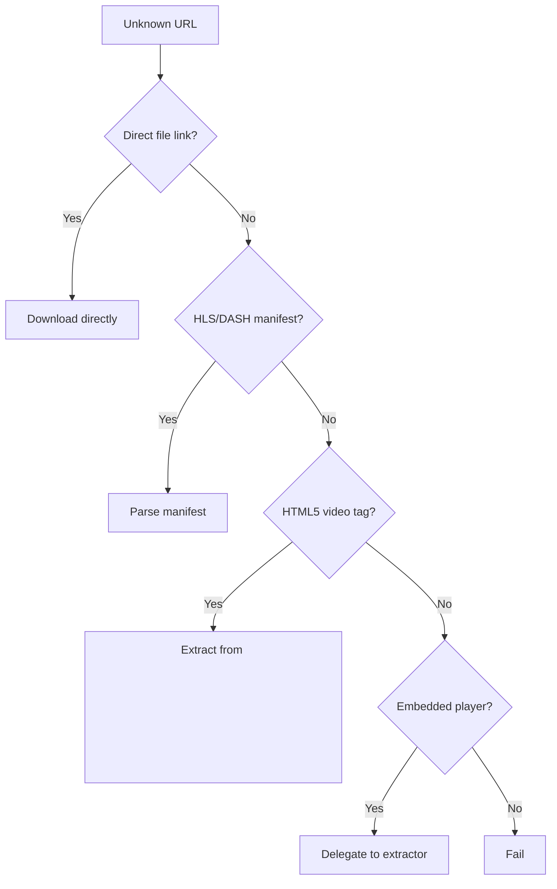

# Generic Extractor

The intelligent fallback extractor that handles unknown sites.

## Overview

**File**: `yt_dlp/extractor/generic.py`
**Complexity**: Medium-Complex
**Key Feature**: Universal URL matching and format auto-detection
**URL Pattern**: `_VALID_URL = r'.*'` (matches EVERYTHING!)

[View source](https://github.com/yt-dlp/yt-dlp/blob/master/yt_dlp/extractor/generic.py)

---

## The Universal Fallback

When no specific extractor matches a URL, GenericIE tries to extract anyway.

**Use cases**:
- Direct video file links (MP4, WebM, etc.)
- HLS/DASH streams without dedicated extractor
- Embedded videos on unknown sites
- News sites with standard HTML5 video tags

---

## Detection Strategy



---

## 1. Direct File Detection

```python
# Check if URL points directly to media file
if determine_ext(url) in MEDIA_EXTENSIONS:
    return {
        'id': url_basename(url),
        'url': url,
        'title': url_basename(url),
        'direct': True,
    }
```

**Supported extensions**: mp4, webm, flv, mkv, avi, mp3, m4a, etc.

---

## 2. Format Auto-Detection

```python
# Download with HEAD request to check Content-Type
response = self._request_webpage(HEADRequest(url), video_id, fatal=False)
content_type = response.headers.get('Content-Type', '')

if 'video/' in content_type or 'audio/' in content_type:
    # Direct media file
    return self._extract_direct_link(url)
elif 'mpegurl' in content_type or url.endswith('.m3u8'):
    # HLS stream
    return self._extract_m3u8_formats(url, video_id)
elif 'dash+xml' in content_type or url.endswith('.mpd'):
    # DASH stream
    return self._extract_mpd_formats(url, video_id)
```

---

## 3. HTML5 Video Tag Parsing

```python
# Find <video> tags in HTML
video_tags = re.findall(r'<video[^>]*>.*?</video>', webpage, re.DOTALL)

for video_tag in video_tags:
    # Extract source URLs
    sources = re.findall(r'<source[^>]+src="([^"]+)"', video_tag)
    
    for source in sources:
        formats.append({
            'url': urljoin(url, source),
            'ext': determine_ext(source),
        })
```

---

## 4. Embed Detection

GenericIE scans for known embeds:

```python
# YouTube embed
if re.search(r'<iframe[^>]+src="[^"]*youtube\.com/embed/', webpage):
    return self.url_result(youtube_url, 'Youtube')

# Vimeo embed  
if re.search(r'<iframe[^>]+src="[^"]*player\.vimeo\.com/', webpage):
    return self.url_result(vimeo_url, 'Vimeo')

# And 50+ more embed patterns...
```

**Detected embeds**:
- YouTube, Vimeo, Dailymotion
- Facebook, Twitter, Instagram
- Kaltura, JWPlayer, Brightcove
- Many more...

---

## 5. JSON-LD Metadata

```python
# Extract structured data from JSON-LD
json_ld = re.search(
    r'<script[^>]+type="application/ld\+json"[^>]*>(.+?)</script>',
    webpage, re.DOTALL)

if json_ld:
    metadata = json.loads(json_ld.group(1))
    
    title = metadata.get('name') or metadata.get('title')
    description = metadata.get('description')
    thumbnail = metadata.get('thumbnailUrl')
    duration = parse_duration(metadata.get('duration'))
```

---

## Browser Impersonation

For sites with bot detection:

```python
# Use curl_cffi to impersonate real browser
if self.get_param('impersonate'):
    return self._download_webpage(
        url, video_id,
        impersonate=ImpersonateTarget('chrome', '110'))
```

**Why needed**: Some sites block yt-dlp's user-agent.

---

## Example: News Site Video

```html
<!-- Typical news site HTML -->
<article>
    <h1>Breaking News</h1>
    <video controls>
        <source src="/videos/news-2024.mp4" type="video/mp4">
        <source src="/videos/news-2024.webm" type="video/webm">
    </video>
</article>
```

**GenericIE extraction**:
1. Download page
2. Find `<video>` tag
3. Extract `<source>` URLs
4. Return both MP4 and WebM formats
5. User gets best quality

---

## Key Strategies

1. **Multiple detection methods** - Try everything
2. **HEAD requests** - Check Content-Type before downloading
3. **Embed scanning** - Delegate to specific extractors
4. **HTML5 standard support** - `<video>` tags
5. **Structured data** - JSON-LD, OpenGraph
6. **Direct links** - Handle media URLs directly
7. **Manifest parsing** - HLS, DASH, SMIL

---

## Limitations

**Won't work for**:
- Sites requiring JavaScript execution
- Sites with complex authentication
- Sites with obfuscated video URLs
- Sites with custom players

**Solution**: Create dedicated extractor for these sites.

---

## When to Use

**GenericIE is perfect for**:
- Quick downloads from unknown sites
- Standard HTML5 video players
- Direct media links
- Simple embeds

**Create dedicated extractor for**:
- Frequently used sites
- Complex authentication
- Custom API integration
- Better error handling

---

## Key Takeaways

1. **Universal fallback** - Handles anything not matched by specific extractors
2. **Multi-strategy approach** - Try all detection methods
3. **Standards-based** - Leverages HTML5, JSON-LD, HTTP headers
4. **Embed detection** - Recognizes 50+ embed patterns
5. **Graceful degradation** - Best effort extraction

**Most important extractor after YouTube** - handles thousands of sites automatically!

---

[← SoundCloud](05-soundcloud.md)
